<div align="center">

# Failsafe

Build personal emergency protocols for worst-case scenarios

[![Live][badge-site]][url-site]
[![HTML5][badge-html]][url-html]
[![CSS3][badge-css]][url-css]
[![JavaScript][badge-js]][url-js]
[![Claude Code][badge-claude]][url-claude]
[![License][badge-license]](LICENSE)

[badge-site]:    https://img.shields.io/badge/live_site-0063e5?style=for-the-badge&logo=googlechrome&logoColor=white
[badge-html]:    https://img.shields.io/badge/HTML5-E34F26?style=for-the-badge&logo=html5&logoColor=white
[badge-css]:     https://img.shields.io/badge/CSS3-1572B6?style=for-the-badge&logo=css3&logoColor=white
[badge-js]:      https://img.shields.io/badge/JavaScript-F7DF1E?style=for-the-badge&logo=javascript&logoColor=black
[badge-claude]:  https://img.shields.io/badge/Claude_Code-CC785C?style=for-the-badge&logo=anthropic&logoColor=white
[badge-license]: https://img.shields.io/badge/license-MIT-404040?style=for-the-badge

[url-site]:   https://failsafe.neorgon.com/
[url-html]:   #
[url-css]:    #
[url-js]:     #
[url-claude]: https://claude.ai/code

</div>

---

## Overview

Create step-by-step emergency protocols for critical life scenarios. Define action plans with contacts, trigger conditions, a resource vault for sensitive data, and priority-based execution order. Everything runs locally in the browser with AES-256 encrypted export.

**Live:** failsafe.neorgon.com

---

## Features

- **4 scenario templates** -- Stranded Abroad (Spy Mode), Coma, Death, Incapacitation with pre-built steps
- **Resource vault** -- Store sensitive data (credentials, account numbers, keys) masked until revealed
- **Trigger conditions** -- Define when a protocol activates: event-based, time-based, or manual
- **Priority tags** -- Mark steps as immediate, within 24h, within a week, or when possible
- **Encrypted export** -- AES-256-GCM via Web Crypto API, password-protected .failsafe.json files
- **URL sharing** -- Encode protocols in a shareable URL hash for quick distribution
- **Import/export** -- Drop-in file import with auto-detection of encrypted vs plain JSON

---

## Running locally

ES modules require an HTTP server (not `file://`):

```bash
make serve
# or
python3 -m http.server 8830
```

---

## Architecture



```
failsafe-site/
├── index.html              # App shell
├── css/
│   └── style.css           # Tactical terminal theme
├── js/
│   ├── app.js              # Entry point
│   ├── state.js            # Shared state + localStorage
│   ├── render.js           # DOM rendering (dashboard, editor, steps)
│   ├── events.js           # Event handlers + navigation
│   ├── protocols.js        # CRUD, templates, reorder logic
│   ├── crypto.js           # AES-256-GCM encrypt/decrypt
│   ├── export.js           # JSON export/import + URL hash
│   └── utils.js            # Helpers (uid, toast, escHtml)
├── robots.txt
├── sitemap.xml
├── CNAME
├── Makefile                # PORT = 8830
└── docs/
    ├── architecture.mmd
    └── architecture.svg
```

---

<div align="center">
<sub>Part of <a href="https://neorgon.com/">Neorgon</a></sub>
</div>
